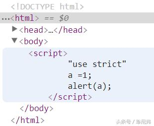

> **在CSS中，像img和video标签元素一直存在长宽比的控制问题，只能通过媒体查询来实现在不同设备下的显示大小，这在特在响应式设计中，增添了许多麻烦。但CSS3object-fit和object-position的出现（object-fit和object-position适用于替换元素），可以让其变得简单。可以让图片尺寸在原来的基础上进行缩放，又不会使图像变形。在讲这个之前，来聊聊何为替换元素，非替换元素**

# 替换元素与非替换元素

- 替代元素

替代元素是浏览器根据其标签的元素与属性来判断显示的具体内容。eg：<input>ype ="text"> 这是一个文本输入框，换一个其他的时候，浏览器显示就不一样了。常见的替换元素有 <input> <textarea> <select><svg>

- 非替换元素

HTML的大多数元素是不可替代元素，它们将内容直接告知浏览器，将其显示出来。eg：<p>我是非替换元素</p>

# object-fit：适用于替换元素

- fill

object-fit的默认值，此值为boject-fit的默认值，替换内容的大小被设置为填充盒子的大小，也就是说，替换元素的显示大小相当于填充盒子的大小

- contain

替换元素内容大小保持长宽比例填充元素容器，其大小被解析为一个包含元素的宽度和高度。也就是说，如果你在替换元素上设置一个明确的高度和宽度，此值将导致内容大小，完全在固定的比例显示，不会占满填充盒子

- cover

按填充盒子，也就是替换元素的父级进行尺寸比例的缩放，保证内容区域被填满。因此，如果替换元素的大小小于其父级盒子的大小，可替换元素可能会被切掉一部分，从而不能完整展示

- none

被替换的元素的尺寸以保持为本身所具有的大小和比例，图片大小大于填充盒子的话，那么会显示不完整，还会失真，图片大小小于填充盒子，显示完整，但不会占满整个填充盒子空间

- scale-down

内容的尺寸仿佛none或contain指定了，按照等比例进行缩放，以更小的具体对象的大小呈现

> ```
> //cssli{position:relative;float:left;width:100px;height:100px;}li img{width:100%;height:100%;background-color:#000;}.fill{object-fit:fill;}.contain{object-fit:contain;}.cover{object-fit:cover;}.none{object-fit:none;}.scale{object-fit:scale-down;}//html<ul> <li>  </li> <li>  </li> <li>  </li> <li>  </li> <li>  </li> </ul>
> ```


# object-position

object-position: position（取值和CSS的position一模一样，不过默认值为50% 50%，也就是居中效果）

> ```
> .box{position:relative;float:left;margin:2px;width:100px;height:100px;background:#000;}.img1{width:100%;height:100%;object-fit: contain;object-position: 0 0;}.img2{width:100%;height:100%;object-fit: contain;object-position: 10px 0;}.img3{width:100%;height:100%;object-fit: contain;object-position: 50% 50%;//居中显示}<div class="box"> </div><div class="box"> </div><div class="box"> </div>
> ```

